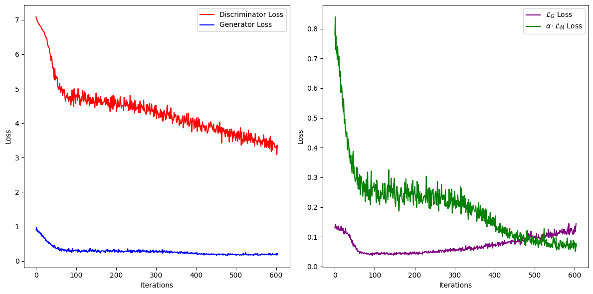
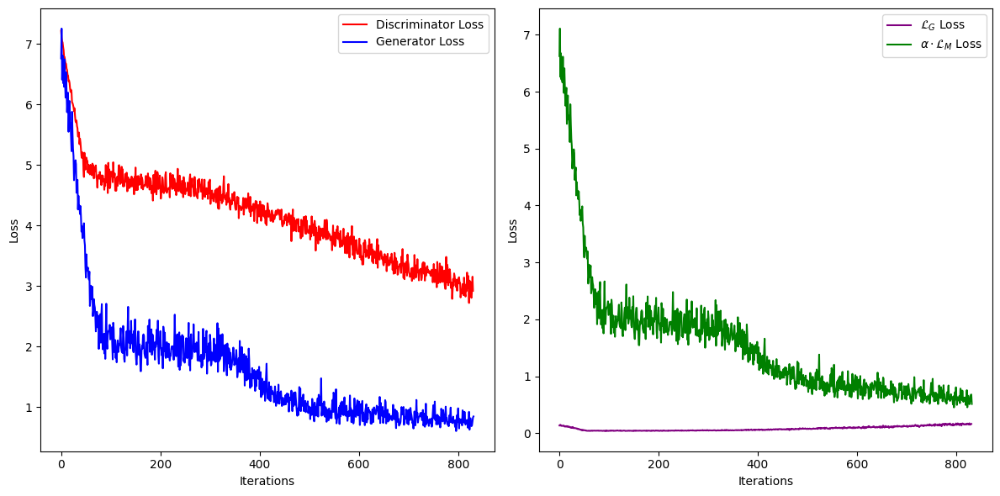

# EGAIN
Abolfazl Saghafi, Soodeh Moallemian, Miray Budak, and Rutvik Deshpande, EGAIN: Enhanced Generative Adversarial Networks for Imputing Missing Values, under review by TMLR, March 2025.

<code style="color : red">Note: the main EGAIN codes are not shared yet as we are waiting for the reveiw process to conclude.</code>

# Requirements
Main required packages and their versions:
```console
python>=3.11.11
numpy>=1.26.4
pandas>=2.2.2
tensorflow>=2.18.0
scikit-learn>=1.6.1
matplotlib>=3.10.0
tqdm>=4.67.1
```

# Installation
To install EGAIN using pip, first install the above requirements with their versions, then:
```console
!pip install EGAIN

## Import requirements
##-------------------
import sys
import time
import numpy as np
import pandas as pd
import tensorflow as tf
import matplotlib.pyplot as plt
from tqdm import tqdm
from tensorflow.keras.models import Model
from tensorflow.keras.layers import Dense, Input, Flatten, MaxPooling1D, Conv1D
from sklearn.preprocessing import MinMaxScaler
from sklearn.metrics import root_mean_squared_error
from EGAIN import EGAIN
from EGAIN import plot_losses, rounding, rmse_loss
```
Alternatively, you can install EGAIN directly from this github page:
```python
## Clone EGAIN 
!git clone https://github.com/asaghafi/EGAIN.git

## Install requirements
%cd /content/EGAIN
!pip install -r requirements.txt

## Import utility functions
import sys
sys.path.append('/content/EGAIN')
from utils import *
from EGAIN import EGAIN
```


# Impute Missing
After loading the data and storing it as numpy ndarray (float), set hyperparameters, then use EGAIN function to impute missing values:

```python
## Load data with missing values and store it as numpy ndarray
##-------------------
data_x = pd.read_csv('/content/EGAIN/data/example.csv').to_numpy(dtype=float)

## Set hyperparameters
##-------------------
# batch_size: 64 (default)
# hint_rate: 0.90 (default)
# alpha: 80 (default), can be adjusted after a test run
# iterations: 1000 (default)
egain_parameters = {'batch_size': 64, 'hint_rate': 0.90, 'alpha': 80, 'iterations': 1000}

## Use EGAIN to impute missing values in data_x
##-------------------
# Options: (default is False)
# plots: True/False: whether to plot the generator, discriminator loss functions
# retrain: True/False: whether to use the weights from previous run to retrain
imputed_data = EGAIN(data_x, egain_parameters, retrain=False, plots=True)
```

## Best `alpha`
It is best to set `plots=True` for the first run. A chart like the following will be generated, after the training iterations complete. On the right you have the $\mathcal{L}_G$ Loss that is only applied to imputed missing $(m_i=0)$ and penalizes G if D performs well by correctly outputting low chances. $\alpha \cdot \mathcal{L}_M$ Loss is only applied to observed values $(m_i=1)$ encouraging the generator to produce realistic values that deceive the discriminator.
[](data/breast_20miss_10alpha_1000iterations_90hint_64batch.png)

In the above chart, `alpha=10` is chosen. Change value of hyperparameter `alpha` so that the Generator Loss starts around the value of the Discriminator Loss, similar to the following chart where `alpha=80` is chosen. 
[](data/breast_20miss_80alpha_1000iterations_90hint_64batch.png)

## Best iterations
`iterations=1000` are enough for most datasets. After setting proper `alpha`, if the generator and discriminator loss in the charts still have a decreasing pattern, increase the number of iterations. If the losses terminate earlier than 1000 iterations, similar to the two charts above, your choice of iteration is fine. In this case, it is best to train again, this time set `retrain=True`, so that the new training is launched using the best weights from last training. You can use the same parameters for the retraining. 

## Best Batch Size
Generally, select batch size so that (batch_size/total_cases) < 10% of total cases. Using 32/64 for small (under 1k cases), 64/128 for medium (between 1k and 5k), 128/256 for large (more than 5k cases) generates reliable results. Increasing the batch size increases the imputation runtime. 

## Best Hint Rate
There is no resaerch on the best value of hint rate. 90% is used as a default value. 

# Simulations
If you have a complete data without missing values and you are trying to assess performance of EGAIN, use the following codes to generate MCAR missing values from the complete data, impute the missing using EGAIN, assess performance of EGAIN using RMSE calculated only for the imputed values and their values from complete data.
```python
## Import requirements
##-------------------
import sys
import time
import numpy as np
import pandas as pd
import tensorflow as tf
import matplotlib.pyplot as plt
from tqdm import tqdm
from tensorflow.keras.models import Model
from tensorflow.keras.layers import Dense, Input, Flatten, MaxPooling1D, Conv1D
from sklearn.preprocessing import MinMaxScaler
from sklearn.metrics import root_mean_squared_error
from EGAIN import EGAIN
from EGAIN import plot_losses, rounding, rmse_loss

# Set seed for reproducibility
np.random.seed(25)

## Load complete data and store it as numpy ndarray
##-------------------
full_date = pd.read_csv('/content/EGAIN/data/example.csv').to_numpy(dtype=float)

# Store results
egain_time  = []
egain_rmse = []

# Perform 10 runs
##--------------------
for run in range(1, 11):
  ## Generate missing
  # ncols=0: randomly from all columns
  # ncols=int: randomly from int columns that are selected randomly
  data_x = mcar_missing(full_data, ncols=0, miss_rate=0.5, random_seed=25)

  ## Impute Missing
  tf.keras.backend.clear_session()
  start_time = time.time()
  egain_parameters = {'batch_size': 64, 'hint_rate': 0.90, 'alpha': 80, 'iterations': 1000}
  imputed_data = EGAIN(data_x, egain_parameters)
  egain_parameters = {'batch_size': 64, 'hint_rate': 0.90, 'alpha': 80, 'iterations': 1000}
  imputed_data = EGAIN(data_x, egain_parameters, retrain=True)
  end_time = time.time()

  # Performance
  egain_time.append(end_time - start_time)
  egain_rmse.append(rmse_loss(full_data, data_x, imputed_data))

#  DataFrame all results
results = pd.DataFrame()
results['time_'] = egain_time
results['rmse_'] = egain_rmse
results.to_csv('/content/results.csv')
print(results)
```
